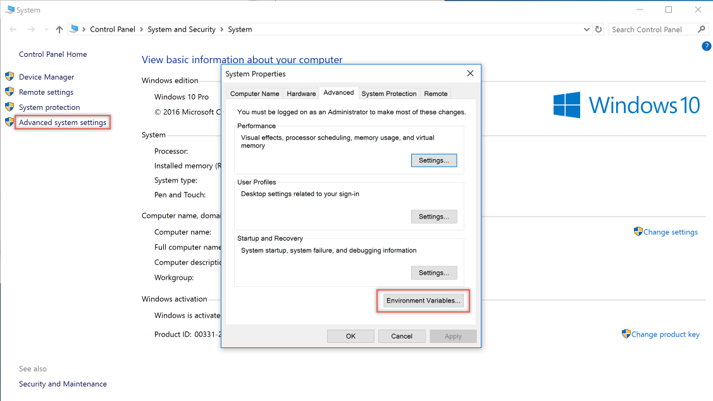

# Configuring Different Environments
by [Eric Fleming](https://ericflemingblog.wordpress.com)

In ASP.NET Core controlling application behavior across multiple environments, such as developement, staging, and production, has been improved through the expanded use of environment variables. Environment variables are used to indicate which environment the application is running in, and can be detected programmatically allowing the application to be configured appropriately.

## Environment Based Settings Files
The constructor of the Startup class, found below, provides the ability to use more than one appsettings.json file by leveraging these environment variables. Since the `appsettings` configurations are [read in the order they are specified](https://docs.microsoft.com/en-us/aspnet/core/fundamentals/configuration), the general `appsettings` configuration will be loaded first, followed by an environment specific `appsettings` configuration.

```c#
public Startup(IHostingEnvironment env)
{
    var builder = new ConfigurationBuilder()
        .SetBasePath(env.ContentRootPath)
        .AddJsonFile("appsettings.json", optional: false, reloadOnChange: true)
        .AddJsonFile($"appsettings.{env.EnvironmentName}.json", optional: true)
        .AddEnvironmentVariables();
    Configuration = builder.Build();
}
```

The following loads the environment specific `appsettings.json` configuration;

```c#
.AddJsonFile($"appsettings.{env.EnvironmentName}.json", optional: true)
```
 
where `{env.EnvironmentName}` corresponds to the environment variable `ASPNETCORE_ENVIRONMENT`. When using Visual Studio, the value for the `ASPNETCORE_ENVIRONMENT` variable can be found in your project's debug profiles show below:


and should be set to `Development` by default.

Environment variables will be updated throughout the environments; for example, on Staging the environment variable will likely be set to `Staging`, and for production it will likely be set to `Production`.

> Note: On Windows or macOS, environment names are not case sensitive meaning `DEVELOPMENT`, `Development` and `development` will all provide you the same result. On Linux, since it is a case sensitive OS by default, assuming case sensitivity for environment variables is encouraged.

## Developer Error Page
In order to easily interact with specific environments, ASP.NET Core has provided the `IHostingEnvironment` abstraction which can be injected into the startup logic via [Dependency Injection](https://docs.microsoft.com/en-us/aspnet/core/fundamentals/dependency-injection). For example, in the constructor above, the `IHostingEnvironment` is used to access the `EnvironmentName` when loading configuration files.

In order to use this `IHostingEnvironment` for displaying the developer error page only in the `Development` environment, add the following to the `Configure` method of the `Startup` class.

```c#
public void Configure(IApplicationBuilder app, IHostingEnvironment env, ILoggerFactory loggerFactory)
{
    if (env.IsDevelopment())
    {
        app.UseDeveloperExceptionPage();
        app.UseBrowserLink();
    }
    else
    {
        app.UseExceptionHandler("/Home/Error");
    }
```

In the above, the `IHostingEnvironment` provides a method `IsDevelopment` which checks the `ASPNETCORE_ENVIRONMENT` variable for the value `Development`. If this is true the developer error page, which should typically not be run in a production environment, will be used to display errors. If it is any other environment, the standard error handling page will be used. 

## Use launchSettings to Set Environment in Visual Studio
The `Properties` folder in Visual Studio contains the `launchSettings.json` file. The `launchSettings.json` holds settings specific to each profile Visual Studio is configured to use to launch the application, including any environment variables that should be used. For the development environment in Visual Studio, the `IIS Express` profile will be used. This profile also specifies to use the `ASPNETCORE_ENVIRONMENT` variable with a value of `Development`.

```c#
{
  "iisSettings": {
    "windowsAuthentication": false,
    "anonymousAuthentication": true,
    "iisExpress": {
      "applicationUrl": "http://localhost:62101/",
      "sslPort": 0
    }
  },
  "profiles": {
    "IIS Express": {
      "commandName": "IISExpress",
      "launchBrowser": true,
      "environmentVariables": {
        "ASPNETCORE_ENVIRONMENT": "Development"
      }
    }
  }
}
```

Adding profiles can be done by adding them to the `launchSettings.json` file. For example, adding a new profile for the Staging environment with a different value for the `ASPNETCORE_ENVIRONMENT` variable will look like the following:

```c#
{
  "iisSettings": {
    "windowsAuthentication": false,
    "anonymousAuthentication": true,
    "iisExpress": {
      "applicationUrl": "http://localhost:62101/",
      "sslPort": 0
    }
  },
  "profiles": {
    "IIS Express": {
      "commandName": "IISExpress",
      "launchBrowser": true,
      "environmentVariables": {
        "ASPNETCORE_ENVIRONMENT": "Development"
      }
    },
    "IIS Express (Staging)": {
      "commandName": "IISExpress",
      "launchBrowser": true,
      "environmentVariables": {
        "ASPNETCORE_ENVIRONMENT": "Staging"
      }
    }
  }
}
```

There are now two profiles, `IIS Express` and `IIS Express (Staging)`, which can be used to launch the application with their respective environment variables.

> Note: Changes made to project profiles or to launchSettings.json directly may not take effect until the web server used is restarted (in particular, Kestrel must be restarted before it will detect changes made to its environment).
Warning: Environment variables stored in launchSettings.json are not secured in any way and will be part of the source code repository for your project, if you use one. Never store credentials or other secret data in this file. If you need a place to store such data, use the Secret Manager tool described in [Safe storage of app secrets during development](https://docs.microsoft.com/en-us/aspnet/core/security/app-secrets#security-app-secrets).

## Manually Set Environment Variables in Windows
To set the `ASPNETCORE_ENVIRONMENT` for the current session, if the app is started using `dotnet run`, the following commands are used

#### Command Line
 ```powershell
 setx ASPNETCORE_ENVIRONMENT "Development"
 ```

 ```powershell
 $Env:ASPNETCORE_ENVIRONMENT = "Development"
 ```

 These commands take effect only for the current window. When the window is closed, the `ASPNETCORE_ENVIRONMENT` setting reverts to the default setting or machine value. In order to set the value globally on Windows open the Control Panel > System > Advanced system settings and add or edit the `ASPNETCORE_ENVIRONMENT` value.




 ## Manually Set Environment Variables in macOS
 Setting the current environment for macOS can be done in-line when running the application;

  ```bash
 ASPNETCORE_ENVIRONMENT=Development dotnet run
 ```
or using export to set it prior to running the app.

 ```bash
export ASPNETCORE_ENVIRONMENT=Development
 ```

 Machine level environment variables are set in the .bashrc or .bash_profile file. Edit the file using any text editor and add the following statment.

 ```powershell
 export ASPNETCORE_ENVIRONMENT=Development
 ```
