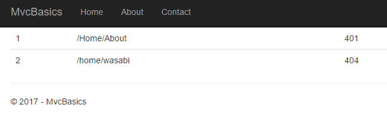

# Working with Data in your ASP.NET Core App
by [James Chambers](http://deviq.com/me/james-chambers)

#### Sample Files
Download a ZIP containing this tutorial's sample files:
- [Completed Version (Pending)] - Includes the completed versions of all MVC tutorials

To really start to add value to your application you're going to need to start loading, saving and displaying data. In ASP.NET Core MVC the tool of choice will likely be Entity Framework Core, or EF Core. In this example you're going to explore the idea of logging HTTP 404 errors to an in-memory database.

## Entity Framework Core

According to the documentation, [Entity Framework](https://docs.microsoft.com/en-us/ef/core/) is "an object-relational mapper (O/RM) that enables .NET developers to work with a database using .NET objects". The database you connect with doesn't really matter to your code and you don't have to worry about the details. In fact, you can use a relational data store such as SQL Server, or you can use an in-memory database or any other back-end and your code will largely remain the same. 

By using a pre-built library you can avoid having to write a lot of the data access code on your own, which you can observe by using the in-memory database provider that EF Core supports. To do so, you need to first add a reference to the relevant library to your project. Right-click on your project and select "Manage NuGet Packages..." then install `Microsoft.EntityFrameworkCore.InMemory`. Behind the scenes, NuGet will pull in the `Microsoft.EntityFrameworkCore` package as well, giving you all the primitives, base types and features of the OR/M, while the `InMemory` package gives you the ability to use an in-memory data store.

## Configuring a Database Provider

With a goal of making it easier to use EF across your project, you can take a cue from what you learned about [Dependency Injection](controller-dependencies.md) and register your service with the DI container. To do this, you'll add a class that inherits from `DbContext`, one of the primary abstractions in Entity Framework. 

In this example, you're creating an in-memory database that will be used to track error messages while the application is running.  Create a `Data` folder in your project and add the following classes:

```c#
public class ErrorContext : DbContext
{
    public ErrorContext(DbContextOptions<ErrorContext> options) : base(options) { }
    public DbSet<ErrorInformation> Errors { get; set; }
}

public class ErrorInformation
{
    public int ErrorInformationId { get; set; }
    public string Path { get; set; }
    public int StatusCode { get; set; }
}
```

`DbContext` and `DbSet` are provided to us in the `Microsoft.EntityFrameworkCore` package. The context is a class that contains the code needed to talk to a database provider, and the `DbSet<T>` represents a collection of data which you can envision as rows stored in a table. The breadth and depth of these classes and the methods supported and exposed by them can be further studied at [the docs site](https://docs.microsoft.com/en-us/ef/core/index).

Now, go to your `Startup` class and add the following code before the call to `services.AddMvc();`:

```c#
public void ConfigureServices(IServiceCollection services)
{
    // ... other services
    services.AddDbContext<ErrorContext>(opt => opt.UseInMemoryDatabase());
    services.AddMvc();
}
```
You may have noticed that the `ErrorContext` class has a constructor that accepts a generic `DbContextOptions<T>` parameter. This is what allows the framework to assemble dependency chains at runtime.  You'll note in the call to `AddDbContext` that there is a lambda expression where the application is configured to use an in memory database. This pattern, combined with the constructor, provides the abstraction required to separate the configuration needed to talk to a database from the objects used to manipulate it. 

You could just as easily store a connection string in your [application configuration](configuration.md) and connect your context to a SQL database. Rather than using the `Microsoft.EntityFrameworkCore.InMemory` package above you'd use `Microsoft.EntityFrameworkCore.SqlServer` instead, and your call in `ConfigureServices` would look similar to the following:

```
services.AddDbContext<ErrorContext>(options =>
    options.UseSqlServer(Configuration.GetConnectionString("ErrorDatabaseConnectionString")));
```

> Note that the `InMemory` provider is intended for testing and prototyping and is not a production data store. Each time your application starts a new copy of the database is created and, likewise, any data built up at runtime is lost when your process ends.

## Collecting Some Data

The next step is to start adding some data to your database, and one way to do this in your error logging feature is through [Middleware](middleware-basic.md).  Create a folder in your project called `Middleware` and then add a new middleware class by right-clicking on the folder and selecting "Add -> New Item". Choose the Middleware class template, and name the class `ErrorCollectingMiddleware`. 

Modify the constructor so that it accepts the `ErrorContext` that you created and configured earlier:

```c#
public ErrorCollectingMiddleware(RequestDelegate next, ErrorContext context)
{
    _next = next;
    _context = context;
}
```

Next, create a backing field for the context so that you can access it throughout your class:

`private readonly ErrorContext _context;`

Finally, update the `Invoke` method to the following:

```c#
public async Task Invoke(HttpContext httpContext)
{
    await _next(httpContext);

    if (httpContext.Response.StatusCode >= 400)
    {
        _context.Errors.Add(new ErrorInformation
        {
            Path = httpContext.Request.Path,
            StatusCode = httpContext.Response.StatusCode
        });
        await _context.SaveChangesAsync();
    }
}
```

There are two important things to note about the data and the context after the application waits for the call `_next` to complete. First, whenever it sees an HTTP status code at or above 400 it creates a new `ErrorInformation` object on the fly and adds it to the `DbSet<ErrorInformation>` property that is defined in the context. Secondly, a call is made to `SaveChangesAsync` to commit the new row to the table.

To bring the logging online you have to wire in the middleware, which you've [seen before](middleware-basic.md). The intent here is to wrap the execution around the MVC pipeline to capture the errors. To do so, add it to the `Configure` method in your `Startup` class, just before the call to `app.UseMvc()`. You can use the extension method that was created for you in the templated middleware class:

```c#
public void Configure(IApplicationBuilder app, IHostingEnvironment env, ILoggerFactory loggerFactory)
{

    loggerFactory.AddConsole(Configuration.GetSection("Logging"));
    loggerFactory.AddDebug();

    app.UseErrorCollectingMiddleware();

    app.UseMvc(routes =>
    {
        routes.MapRoute(
            name: "default",
            template: "{controller=Home}/{action=Index}/{id?}");
    });

    app.UseStaticFiles();

}
```

All that's left to do is for you to cause some errors! The easiest way to do this is to try to access pages that you know don't exist in your application, which gives an HTTP 404 error, indicating that the client has requested a resource that doesn't exist. You could also add some faulty code or throw an exception from a controller action, which would translate into an HTTP 500 server side error. As you navigate and cause problems for your application, you'll be storing the error information in your in-memory database.

## Displaying Data in A View

Now add a new controller called `ViewErrorsController` to your project in the `Controllers` folder and add a constructor that accepts an instance of your `ErrorContext` as well as the corresponding backing field.

```c#
private readonly ErrorContext _context;

public ViewErrorsController(ErrorContext context)
{
    _context = context;
}
```

Add an `Index` action to the controller that uses the context to capture a list of errors and pass them to a view.

```c#
public IActionResult Index()
{
    var errors = _context.Errors.ToList();
    return View(errors);
}
```

> **Note** {.note} 
> Controllers are supposed to be concerned about views, about validating application input and assembling the components required to render a web page for the user. So why are we talking to the database in a controller? The DI piece makes it easy in this case, but it doesn't make it right. The biggest problem here is that our view and our controller have become tightly coupled to the underlying data entities, which will cause problems down the road. Be sure to check the Next Steps at the end of this article for ideas on how to improve this technical debt by using repositories or the mediator pattern.

To see your data rendered in the browser at runtime you're going to need a [view](views.md). You'll follow [standard convention](controllers-actions.md) here, so add a `ViewErrors` folder under your `Views` directory in the project and add a new view called `Index.cshtml`. The requisite code to render a table of errors is as follows:

```html
@model IEnumerable<MvcBasics.Data.ErrorInformation>

<table class="table">
    @foreach (var error in Model)
    {
        <tr>
            <td>@error.ErrorInformationId</td>
            <td>@error.Path</td>
            <td>@error.StatusCode</td>
        </tr>
    }
</table>
```

When you restart your application you will have the ability to navigate to `/ViewErrors/` and see any that have surfaced. Remember that your in-memory database will have reset on each execution, so you may have to generate a few errors to get the data showing. Your end result should look something like this:



## Filtering and Shaping Our Data

The `Errors` property you have on your `ErrorContext` class is of type `DbSet<T>` which implements the `IEnumerable` and `IQueryable` interfaces. This enables many interesting LINQ scenarios such as deferred execution, grouping and ordering. You can chain together various query parts before using the `ToList` extension method, and Entity Framework will take care of optimizing the query behind the scenes for you. For instance, if you wanted to extract a list of 404 errors by page and get a count of each, ordered by the path you could put together a LINQ statement like so:

```c#
var notFoundErrors = _context.Errors
    .Where(e => e.StatusCode == 404)
    .GroupBy(e => e.Path)
    .OrderBy(g => g.Key)
    .ToList();
```

At runtime, the `IQueryable` components of the above statement defer execution until an iterator is invoked on the set. By putting off a query to the database until the data is needed, an optimized version of the query can be assembled and executed a single time, only returning the data that is required. For more information about working with data sets in LINQ, be sure to review the EF tutorial on the [docs site](https://docs.microsoft.com/en-us/aspnet/core/data/ef-mvc/intro);


## Next Steps
 - Improve on this design by creating a view model class that can be used to store different sets of errors, grouped by type. Update the view to use this model, and pass it from the controller.
 - Read more about the [repository pattern](http://deviq.com/repository-pattern/) and [mediator pattern](https://en.wikipedia.org/wiki/Mediator_pattern) and check out the [MediatR library](https://github.com/jbogard/MediatR) for an implementation. Use these patterns to decouple the controller from the 'DbContext' class and the implementation details of how the app handles persistence.
 - Explore the more complete concept this tutorial was based on in the June 2016 MSDN Article [Use Custom Middleware to Detect and Fix 404s in ASP.NET Core Apps](https://msdn.microsoft.com/en-us/magazine/mt707525.aspx) by [Steve Smith](http://deviq.com/me/steve-smith)