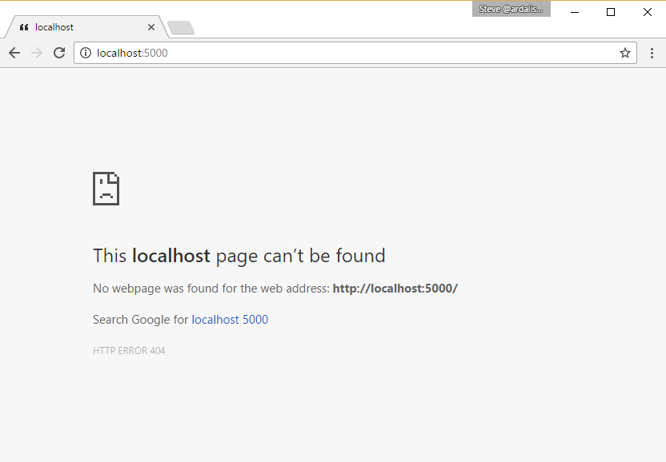

# Adding Diagnostics to the App
by [Steve Smith](http://deviq.com/me/steve-smith)

#### Sample Files
Download a ZIP containing this tutorial's sample files:
- [Initial Version] - Use this as a starting point when following along with the tutorial yourself
- [Completed Version] - Includes the completed versions of all samples

## Figuring Out Why Things Go Wrong

One of the most challenging and often frustrating parts of writing software is figuring out what's wrong when it doesn't work. Fortunately, ASP.NET Core provides some nice diagnostics functionality that you can add to any app as [middleware](middleware-basic.md). In the quotes app you've been building so far, if an error occurs during a request, you don't see much information about it in the browser. By default, the server just returns a 500 or similar error code and no content at all, so if you're not using developer tools, you'll just see a blank web page. This isn't particularly useful, diagnostically, so one of the first things you'll want to enable is the developer exception page middleware. It can also be helpful to provide support for status code pages (like a custom 404 Not Found page).

## Developer Exception Page

To demonstrate an error in the current quotes app, run the app and navigate to `/quote/0`. You should see the first quote (either in the ``QuotationStore`` or being read from the `quotes.json` file). Likewise, `/quote/1` and `/quote/2` should display the second and third quotes. However, unless you've added more quotes, there are no more quote beyond these three. Trying to navigate to `/quote/3` (the fourth quote - any number larger 2 will behave similarly) will yield an HTTP 500 error and a blank page. 


In this case, you've probably already guessed that the problem is that you're trying to access an item in the collection that's outside the bounds of the collection. But errors aren't always so apparent. The developer exception page will make the problem much easier to find.  This middleware will display detailed exception information any time an exception occurs as part of a request. It's recommended that you only enable this middleware during development; you'll learn more about this in the [environments lesson](environments.md).

Before you can use this middleware, you'll need to make sure you've added the `Microsoft.AspNetCore.Diagnostics` package. Once you have, you can add the following to your ``Configure`` method in `Startup`:

```c#
public void Configure(IApplicationBuilder app, 
    IOptions<List<Quotation>> quoteOptions)
{
    app.UseDeveloperExceptionPage();
    app.UseStaticFiles();
    
    // other middleware
}
```

With this middleware in place, if you once more navigate to `/quote/3` you should see a much more detailed explanation of the problem:


The developer error page middleware shows the stack trace of the exception that was thrown, as well as additional information about the request that threw the exception. In addition to the stack trace, the page shows the request's query string values, if any, along with cookies and headers. Again, because sensitive information about the app may be displayed by this middleware, it should not be used in a production environment.

> **Note** {.note}    
> The Developer Exception Page middleware can only handle exceptions that occur in middleware configured later in the request pipeline. Thus, it's important that it be one of the first instance of middleware configured in your app.

## Status Code Pages

Whenever a request is returned from a web server, it includes a status code. The most common status code is 200 Success, but it's also the least interesting. Other common status codes include 500 for errors (see the developer exception page above to handle these) and 301/302 redirects. However, the status code that even most non-programmers know is 404 Not Found. It's common, and almost expected, for apps to have a custom 404 page that greets users who somehow find themselves off the beaten path within the app. The status code pages middleware supports a variety of status codes and options (see the [docs](https://docs.microsoft.com/en-us/aspnet/core/fundamentals/error-handling#configuring-status-code-pages)). For the quotes app, you're going to add a custom 404 page.

Currently, the app's last piece of middleware will handle any request that wasn't handled by other middleware, and will return a random quote. In order to need 404s, you'll first need to have paths that don't reach any middleware. Change the last middleware from ``app.Run`` to ``app.Map`` and map it to the `/random` path:

```c#
app.Map("/random", builder => builder.Run(async context =>
{
    await context.Response.WriteAsync(QuotationStore.RandomQuotation().ToString());
}));
```

Now going to any unsupported page (including the root of the site) should yield a 404 (and a blank page by default):



To enable basic support for status page, just add the middleware like so, somewhere early in the request pipeline:

```c#
app.UseStatusCodePages();
```

You'll also need to remove the middleware you added earlier in the tutorial that set the content type for the response:

```c#
// DELETE THIS:
app.Use(async (context, next) => 
{   
    context.Response.ContentType="text/html";
    await next();
});
```

Since that middleware writes to every response, the status code pages middleware never fires because it sees that the response has already begun. With those two steps, your app should now return a very simple text response to 404s:


You can further customize the response to provide your own message, change the output to HTML from plain text, or specify a redirect to a static HTML file. For now, you can simply customize the response by passing two strings to the middleware:

```c#
app.UseStatusCodePages("text/plain","HTTP Status Code: {0}");
```

The `{0}` value in the second argument is a placeholder for the status code, which in this case should be 404 when you test the page by navigating to the root of your app.

## Next Steps

Create a custom 404 page, `404.html`, in the `wwwroot` folder of the quotes sample. Configure the status code pages middleware to redirect status codes to their appropriate pages using the format `~/{0}.html`. An example:

