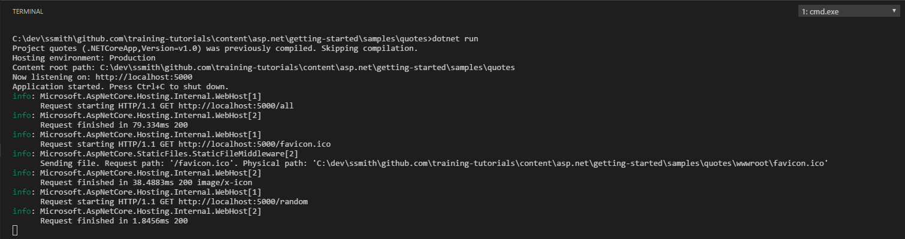

# Adding Logging to the App
by [Steve Smith](http://deviq.com/me/steve-smith)

#### Sample Files
Download a ZIP containing this tutorial's sample files:
- [Initial Version] - Use this as a starting point when following along with the tutorial yourself
- [Completed Version] - Includes the completed versions of all samples

## Configuring Logging

Logging provides information about a running app that may be useful to a developer or system administrator. By default, ASP.NET Core logs a great deal of information about individual requests. You can configure a logger to allow you to view this information, as well as add your own logging of events of interest to you regarding your app.

To get started with logging, the first thing you should do is add the required package(s) to your project. You will typically need to add a package whenever you want to add a new destination or endpoint to which you wish to send log messages. For this example, you're only going to be logging to the console, so you need to add this package: `Microsoft.Extensions.Logging.Console`. Once you've added the package to your project (and restored your project's dependencies), you can modify *Startup.cs* to include logging support. Update your `Configure` method as follows:

```c#
    public void Configure(IApplicationBuilder app, 
        IOptions<List<Quotation>> quoteOptions,
        ILoggerFactory loggerFactory)
    {
        loggerFactory.AddConsole();
        
        // leave the rest is before
    }
```

Now you can run your app. To see the log output, you need to run the app from a command window, or launch via the kestrel web server in Visual Studio using the launch window (choose the one matching your app name, not 'IIS Express'). When the app starts, you should see some log output. Once you make a request to the app (for instance, navigate to the `/quotes/all` path), you will see many more log statements output to the console.



When you log something in your app, you specify what level of *verbosity* the message should have. The available log levels, in order of least to highest severity, are:

- Trace (disabled by default)
- Debug
- Information
- Warning
- Error
- Critical

[Learn more about log levels](https://docs.microsoft.com/en-us/aspnet/core/fundamentals/logging#log-level).

You can filter out messages of low importance by setting a minimum log level when you configure logging:

```c#
    // only display messages with log level of Information or higher
    loggerFactory.AddConsole(LogLevel.Information);
```

Optionally, you can set different log levels based on where the message originates. A common approach is to specify logging options in a configuration file, such as *appsettings.json*, and pass the configuration section into the *AddConsole* method. A sample *appsettings.json* file:

```javascript
    {
    "Logging": {
        "IncludeScopes": false,
        "LogLevel": {
        "Default": "Debug",
        "System": "Information",
        "Microsoft": "Information"
        }
    }
    }
```

The above settings set the default log level to display at `Debug` (or above), but set a higher threshold of `Information` for log messages originating from `System` or `Microsoft` sources. By adjusting these settings, you can ensure your own app's messages are not drowned out by built-in logging from the framework.

You learned how to add configuration files in the [Configuration](configuration.md) lesson. You can add more than one file from which to read configuration information, so that the app's quotes come from one file while the logging settings come from another:

```c#
    public Startup(IHostingEnvironment env)
    {
        var builder = new ConfigurationBuilder()
            .SetBasePath(env.ContentRootPath)
            .AddJsonFile("quotes.json", optional: false, reloadOnChange: true)
            .AddJsonFile("appsettings.json", optional: false, reloadOnChange: true);

        Configuration = builder.Build();
    }
```

To specify the configuration section when configuring logging, you would use the following code:

```c#
    loggerFactory.AddConsole(Configuration.GetSection("Logging"));
```

## Logging Information

Now that you've configured how your app will send logging messages to the console, it's time to see how to actually log information from your app. First, you'll want to use an `ILoggerFactory` to create an instance of a `Logger`. You typically create a logger for the class that is performing the logging, using the factory's `CreateLogger<T>` method. For instance, in *Startup.cs*, in the `Configure` method, you could add the following code to log a message when the method completed.

```c#
    var logger = loggerFactory.CreateLogger<Startup>();
    
    logger.LogInformation("Configure complete.");
```

Alternately, you can specify the logger source as a string parameter:

```c#
    var logger = loggerFactory.CreateLogger("Sourcename");
```

## Next Steps

Add some additional logging statements to the `Configure` method. Try a variety of log level options, and use the *appsettings.json* file to adjust which level of log messages are shown. You can create multiple loggers with different source values and see how you can specify different minimum log levels for different log sources.
