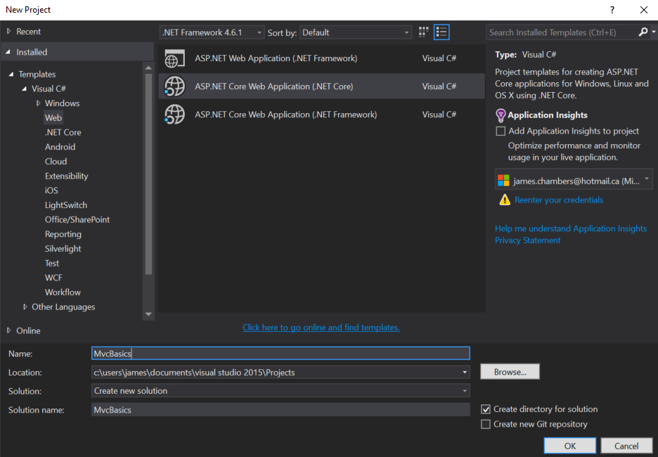
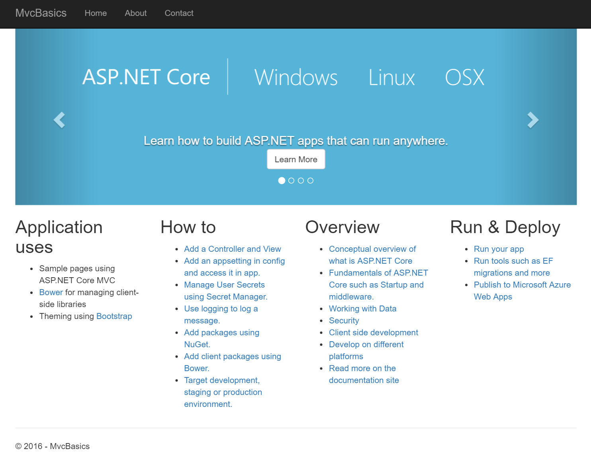

# Introducing ASP.NET Core MVC
by [James Chambers](http://jameschambers.com)

#### Sample Files
Download a ZIP containing this tutorial's sample files:
- [Completed Version (Pending)] - Includes the completed versions of all samples

If you don't already have a copy of Visual Studio 2015, you can download a free copy here:
- [Visual Studio 2015 Community Edition](https://www.visualstudio.com/en-us/visual-studio-homepage-vs.aspx)

Please ensure you have the latest updates:
- [Update Visual Studio 2015](https://www.visualstudio.com/downloads/download-visual-studio-vs)  

>MVC Core builds on the [ASP.NET Core](toc.md) essentials and gives us a framework which we can use to process incoming requests with a structured approach. We use default conventions to take advantage of things like routing, dependency injection and view rendering.
>
>The remainder of this tutorial will use the sample files above as a reference. You can follow along with these next lessons to build the sample on your own, or download the full project and run the completed solution locally.
>
>We will use Visual Studio 2015 for these exercises. Any edition will work provided you are running the latest version.

## Creating Your Project 
Open up Visual Studio 2015 and create a new project from the File -> New -> Project menu. Under the templates selection, choose Web, then pick **ASP.NET Core Web Application (.NET Core)** from the list of available templates. Name your project "MvcBasics".



Press ``Ctrl+F5`` or choose Debug -> Start Without Debugging from the menu. You should see your application open in your default browser. 



## MVC Configuration
The differentiator between a stock ASP.NET application and an MVC-based app are the services and facilities that MVC Core provides. In order to make these services available to the runtime and to our own services we need to first configure them as our application initializes. Here is the code for the ``ConfigureServices`` method in ``startup.cs`` which was included as part of the project template:

```c#
public void ConfigureServices(IServiceCollection services)
{
    // Add framework services.
    services.AddMvc();
}
```

``AddMvc`` is an extension method of ``IServiceCollection`` that gives MVC access to the service container and configures it for use during request processing.  Next, we have the ``Configure`` method, which is the appropriate place to add our middleware:

```c#
public void Configure(IApplicationBuilder app, IHostingEnvironment env, ILoggerFactory loggerFactory)
{
    loggerFactory.AddConsole(Configuration.GetSection("Logging"));
    loggerFactory.AddDebug();

    if (env.IsDevelopment())
    {
        app.UseDeveloperExceptionPage();
        app.UseBrowserLink();
    }
    else
    {
        app.UseExceptionHandler("/Home/Error");
    }

    app.UseStaticFiles();

    app.UseMvc(routes =>
    {
        routes.MapRoute(
            name: "default",
            template: "{controller=Home}/{action=Index}/{id?}");
    });
}

```

In the first part of this block you'll find some code that sets up the logging middleware, exception handling and finally the [static files middleware](static-files.md). Wrapping up the method is the call to ``UseMvc``, an extention method to ``IApplicationBuilder`` that configures the MVC middleware. MVC should be the last thing you provide, as it incurs the cost of processing a request and would add latency to things like static files. Keep this in mind as you order your middleware, and make sure that ``UseStaticFiles`` appears before the MVC middleware.  

## Project Structure and Conventions
In our solution created from the default project template there are a few points to note related to the folder layout and the conventions of the framework. In the root of the project we find some key files, like the ``program.cs`` file with our application entry point, and the ``startup.cs`` file containing the class we were discussing above. There is a ``project_readme.html`` with information about the libraries used in the template and some helpful links related to MVC development.  

You will find the familiar ``project.json`` file, some default application settings in the ``appsettings.json`` file, as well configuration hints for bundling and minification.  To enable our application to run on [Kestrel behind IIS Express](https://docs.asp.net/en/latest/fundamentals/servers.html#servers-and-commands), there is a ``web.config`` file with settings for our [host](hosts.md).

Each project will have a folder called `wwwroot`, configured by [default](https://docs.asp.net/en/latest/intro.html#web-root) to be the base URL for the root of our website. The server will attempt to serve up requests from this folder and its subfolders when the static file middleware is enabled, such as for image and JavaScript requests.

There are two other meaningful folders in the project called "Controllers" and "Views", which contain those respective concepts as files you include in your project. For each controller that returns views from one or more actions, you'll also typically find a folder under "Views" named the same as the controller containing all of its associated views.

When we talk about "MVC" we're talking about Models, Views and Controllers.  Let's talk about those components in greater detail next.

## Models
Models are the properties associated with some kind of business concept. A contact, invoice or movie pass all have some type of representation assosciated with them. In MVC Core they are simply represented as classes that you create in your project or import via a library dependency.

We use models to carry the data we need to our users. Models are typically created or fetched from a service in our Controllers and are passed to our Views for rendering.  

You will learn more about models when we look at [Returning Data or Views from Controllers](results.md) later in this tutorial.

## Views
Views are the mechanism by which we generate the HTML needed to render our web pages for the user's browser. While we don't exclusively write HTML in our Views it is a large part of it. Instead, we use the Razor view engine and [Razor syntax](https://docs.asp.net/en/latest/mvc/views/razor.html) to _output_ HTML.  

You will learn more about views later in this tutorial in [Working with ASP.NET Core MVC Views](views.md).

## Controllers
Controllers are classes that contain the application logic required to respond to incoming requests. Each request is mapped through to a specific method, commonly referred to as an action, and can accept incoming parameters like any other function in your code. 

We'll cover [actions and the controllers](controllers-actions.md) in which they reside in a later lesson. 

## The Default Route in Your Application
While we discussed the basics of routing in [Introducing Routing](routing.md) earlier in this tutorial, it's worth having a look at the configuration of the MVC [middleware](middleware-basic.md) here as well. This configuration is in the code we saw above in ``startup.cs``:

```c#
    app.UseMvc(routes =>
    {
        routes.MapRoute(
            name: "default",
            template: "{controller=Home}/{action=Index}/{id?}");
    });
```

You can think of this route expressed as ``/controller/action/`` with an optional ``id`` parameter. The default controller is ``Home`` and the action, if not specified, will be ``Index``. When you ran the application earlier and saw the template's home page, there was no magic, it was just the default route being activated to execute the ``Index`` action on the ``Home`` controller. 

## Next Steps

Run the app and navigate to the Contact page.

1. What is displayed in the address bar? 
1. Can you locate the code that is executed when you view the Contact page?
1. Are you able to change the text "Your Contact Page." to something of your own creation?   

In the next tutorial we'll look more closely at controllers and actions.