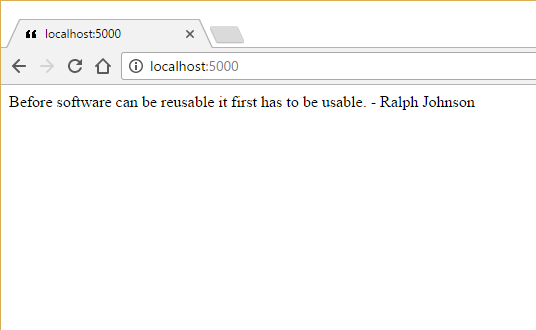

# Serving Static Files
by [Steve Smith](http://deviq.com/me/steve-smith)

#### Sample Files
Download a ZIP containing this tutorial's sample files:
- [Initial Version] - Use this as a starting point when following along with the tutorial yourself
- [Completed Version] - Includes the completed versions of all samples

## Serving Static Files

ASP.NET Core can be used to serve static files, such as images, scripts, HTML files, and more. This functionality is encapsulated in middleware that can be added to any ASP.NET Core app. Once added, files located in the ``wwwroot`` folder (the *web root*) of the root of the app will be accessible via web requests. By default the web root folder is a subfolder of the app's *content root*, which defaults to where the app's assemblies are located.

Working from the [previous lesson](middleware-basic.md) random quotation sample, add support for serving static files by adding ``app.UseStaticFiles();`` in the ``Configure`` method in ``Startup``. It's important to place this statement in the right location in the request pipeline - if it is placed after the ``app.Run`` statement, it will never be reached since that middleware is a catch-all endpoint. Likewise, if you're using [MVC](mvc.md), it won't call any middlware appearing after it, so you'll need to configure static files before the call to MVC as well. The static files middleware will quickly allow requests that don't match a configured path on disk to proceed to the next configured middleware in the pipeline.

In this case, the ``UseStaticFiles`` statement can be the first item in the pipeline:

```c#
public void Configure(IApplicationBuilder app)
{
    app.UseStaticFiles();

    // other middleware
}
```

### Note { .note }
> Before you can use the ``UseStaticFiles`` extension, you must add the static files nuget package to the project: "Microsoft.AspNetCore.StaticFiles".

By default, browsers will make requests for a *favicon.ico* file whenever an HTML request is made. This icon is displayed in the browser's tab or header view. By default the browser expects this file to be in the root of the web site. Having added support for static files to the quotations app, providing a valid favicon just requires adding a *wwwroot* folder to the root of the app, and placing an image file called *favicon.ico* in this folder. You can download a sample file [here](samples/quotes/wwwroot/favicon.ico).

After adding the *wwwroot* folder and *favicon.ico* file, the app should run, but you may (depending on how you run the app) that the icon isn't being sent by the app when requested. If you run the app from the command line using ``dotnet run``, by default the *content root* of the app will be ``\bin\Debug\netcoreapp1.0\``, not the folder where your project files are located. To address this, update *Program.cs* to specify the current folder as content root:

```c#
using System;
using System.IO;
using Microsoft.AspNetCore.Hosting;

namespace ConsoleApplication
{
    public class Program
    {
        public static void Main(string[] args)
        {
            var host = new WebHostBuilder()
                .UseKestrel()
                .UseContentRoot(Directory.GetCurrentDirectory())
                .UseStartup<Startup>()
                .Build();

            host.Run();
        }
    }
}
```

With this in place, you should be able to run the app and see the favicon image displayed. If it's not displayed, you can also verify it's being served by requesting it directly (e.g. http://localhost:5000/favicon.ico). Note the " icon to the left of the URL in the browser tab below:



## Other Files

You can add other kinds of files to the *wwwroot* folder. The most common are HTML, CSS, and JavaScript files, as well as images and other media resources. By default, all files must be referenced using their full name. However, you can configure certain files to be served by default for a folder path (when no file name is referenced) by adding ``app.UseDefaultFiles();`` just before the call to ``app.UseStaticFiles();``. This middleware will automatically redirect requests for the folder to a file named *default.htm*, *default.html*, *index.htm*, or *index.html* (in that order).

## Next Steps

Try adding a static HTML file to the *wwwroot* folder. You should be able to request it by name. Add support for default files and name your HTML file *default.html*. Confirm that the file is served when you navigate to the root of your app.
