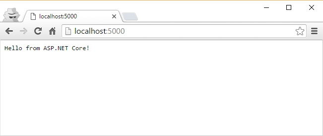

# Your First ASP.NET Core App
by [Steve Smith](http://deviq.com/me/steve-smith)

## Install .NET Core

If you don't already have it installed, make sure you have .NET Core installed along with whatever tooling you'd like to use (for instance, Visual Studio Code or Visual Studio). You can download everything you need from [here](https://microsoft.com/net/core).

## Create a New Console Application

In this lesson, you'll create a new ASP.NET Core web app from a standard .NET Core console application. Along the way, you'll work with a few command line tools and some files that may be new to you. For now, just follow along. You'll learn more about how these things work in subsequent lessons. This lesson will help you understand how an ASP.NET Core web app works, since you'll see how to construct one from a console application. If you just want to quickly create a new ASP.NET app, you can do so with ``dotnet new -t web``.

Open a command prompt and create a new folder for your first ASP.NET Core application. Navigate to that folder and type:

    > dotnet new
    Created new C# project in (path)

This command produces a simple "Hello World" console application, which includes two files:

- Program.cs: Your program
- project.json: Project information, including dependencies on other packages

You can run the application immediately to confirm it works. First, run the ``dotnet restore`` command to download the project's dependencies, and then use ``dotnet run`` to execute it.

    > dotnet restore
    > dotnet run
    Hello World!

> **Note** {.note}    
> If you run ``dotnet run`` without ``dotnet restore``, you will get an error stating that your project is missing a lock file, and indicating that you must first run ``dotnet restore``.

## Convert the Console App into an ASP.NET Core App

To modify this program to be an ASP.NET Core app, you need to add a dependency. Open *project.json* in your editor and add a dependency on "Microsoft.AspNetCore.Server.Kestrel", as shown:

```json
{
  "version": "1.0.0-*",
  "buildOptions": {
    "debugType": "portable",
    "emitEntryPoint": true
  },
  "dependencies": {
    "Microsoft.NETCore.App":{
      "version":"1.0.0",
      "type":"platform"
    },
    "Microsoft.AspNetCore.Server.Kestrel":"1.0.0"
  },
  "frameworks": {
    "netcoreapp1.0": {
      "dependencies": {
        "Microsoft.NETCore.App": {
          "type": "platform",
          "version": "1.0.0"
        }
      },
      "imports": "dnxcore50"
    }
  }
}
```

Once more, restore the project's dependencies (so that this new dependency is downloaded):

    > dotnet restore

Add a new *Startup.cs* file that will define how the ASP.NET Core app handles requests:

```c#
using System;
using Microsoft.AspNetCore.Builder;
using Microsoft.AspNetCore.Hosting;
using Microsoft.AspNetCore.Http;

namespace ConsoleApplication
{
    public class Startup
    {
        public void Configure(IApplicationBuilder app)
        {
            app.Run(context =>
            {
                return context.Response.WriteAsync("Hello from ASP.NET Core!");
            });
        }
    }
}
```

Finally, modify the *Program.cs* file to configure a *host* for ASP.NET, telling it to use the ``Startup`` class you just created, and then running the host.

```c#
using System;
using Microsoft.AspNetCore.Hosting;

namespace ConsoleApplication
{
    public class Program
    {
        public static void Main(string[] args)
        {
            var host = new WebHostBuilder()
                .UseKestrel()
                .UseStartup<Startup>()
                .Build();

            host.Run();
        }
    }
}
```

Run the app with ``dotnet run``:

    > dotnet run
    Now listening on: http://localhost:5000
    Application started. Press Ctrl+C to shut down.

Browse to [http://localhost:5000]. You should see:



## Next Steps

Right now, this web application will respond to every request the same way. You can modify this response by changing what happens inside of the ``app.Run`` block. Change the content type to HTML and have the app return a more nicely formatted response.

You can modify the response to be HTML with the following:

```c#
context.Response.ContentType="text/html";
```

You can format the output to include HTML tags by modifying *Startup.cs* and the "Hello from ASP.NET Core!" string. Try changing it to "Hello from <strong>ASP.NET Core!</strong>".